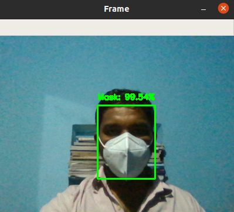
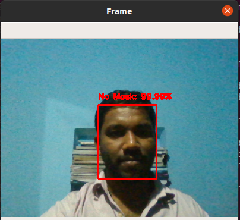

# Who-Isn-t-Wearing-a-Mask-
Wearing masks or cloth face coverings helps stop the spread of COVID-19. ...From the public CCTV ,system capture the photos of person who isn't were mask in public places.............
DATASET and some file are not added to git

